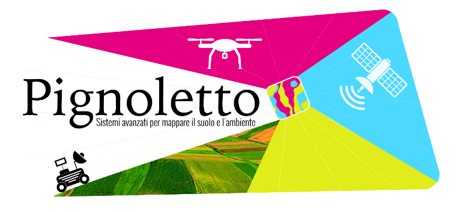
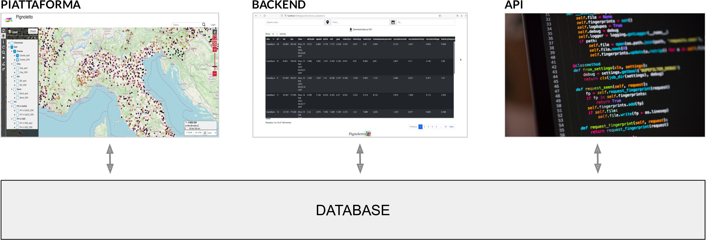
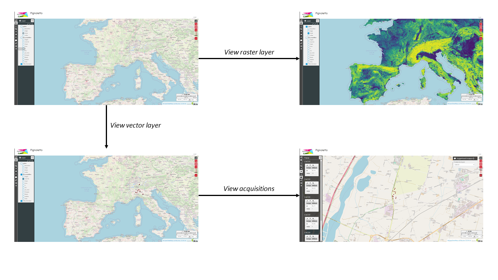
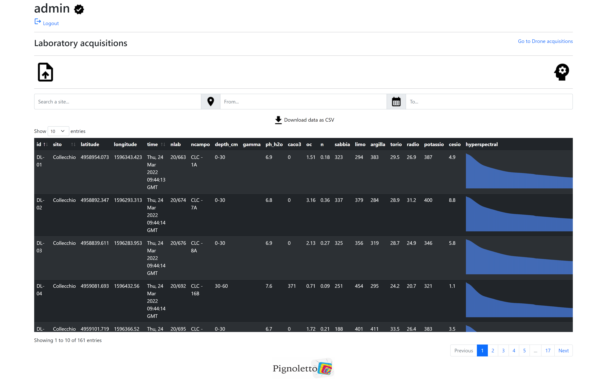

# Pignoletto Platform

This repository contains the source code of [**Pignoletto Platform**](inserire link).

Pignoletto platform is a system designed for the collection, the visualization the
management and the analysis (through manual inspection or automatic detection) of heterogeneous
and multisource data for soil characteristics estimation. The platform is designed in such a way that
it can easily handle proximity, airborne and spaceborne data and furnishes to the final user all the
tools and proper visualizations to perform precision agriculture.

The general architecture of the tool can be seen in the next figure.


As seen, it provides 3 different interface to the system:
* **Platform**, which let users interact with a web map and visualize collected data.
* **Backend**, a Flask web-app that let user manage their data.
* **API**, which allows to insert acquisitions made by drones.

Next, we can see an example of what **Platform** could look like.



Here, instead is presented the interface of **Backend**.



### License
...

### Acknowledgments
...

### Cite

```bibtex
@article{...,
  title={...},
  author={...},
  journal={...},
  year={...}
}
```
